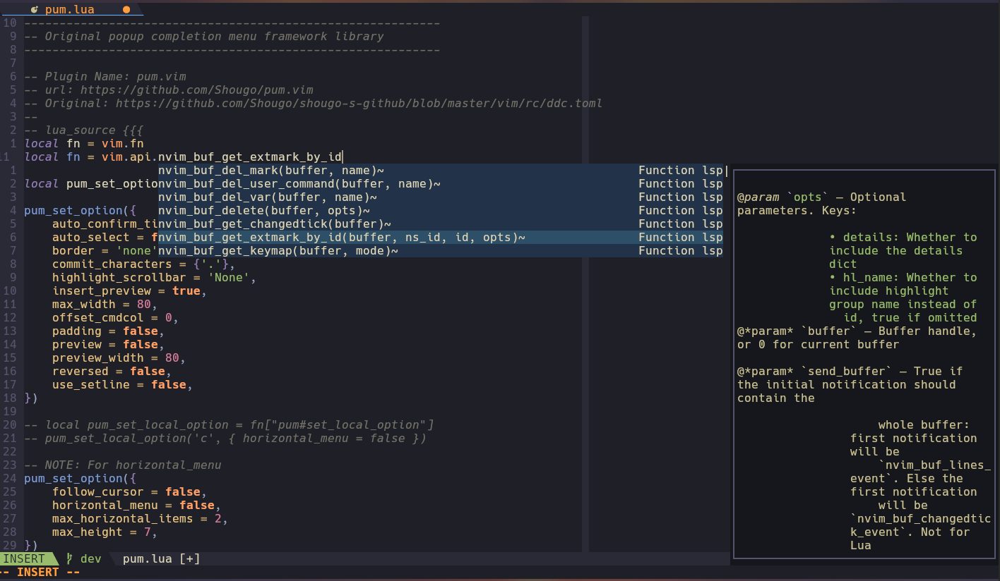
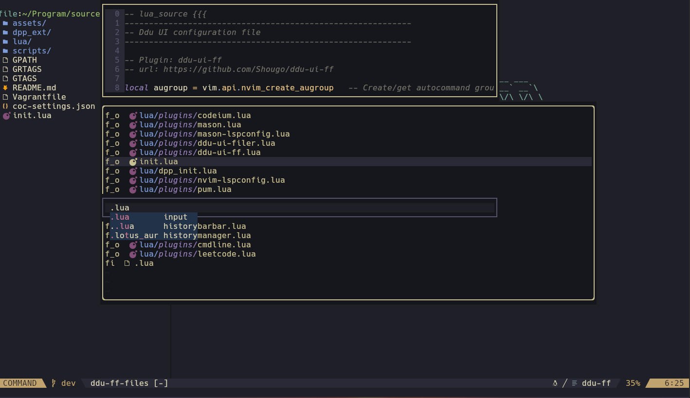

Neovim Luna
=============

Features and Screenshots
------------

* Blazing fast startup
* Plugin manager (by [@dpp.vim](https://github.com/Shougo/dpp.vim))
* Code autocompletion with LSP (by [@ddc.vim](https://github.com/Shougo/ddc.vim)) and AI (by [@Codeium](https://codeium.com/))
* File Manager (by [@ddu-ui-filer](https://github.com/Shougo/ddu-ui-filer))
* Markdown preview (by [@peek.nvim](https://github.com/toppair/peek.nvim))
* Terminal interface (by [@deol.nvim](https://github.com/Shougo/deol.nvim))
* Git management (by [@vim-fugitive](https://github.com/tpope/vim-fugitive))
* Custom github site, which is very useful when you experience bad network when connecting to github.






Dependencies
-----------

* deno
* ripgrep
* jq (make, headless-install script requires)
* fortune-mod (optional, startup message)
* gcc (optional, treesitter support)
* global (optional, gtags support)
* python-pygments (optional, gtags support)

### Deno

`ddp.vim` and `ddu.vim` depens on `deno`, a javascript runtime. You can install it via your package manager or the following command.
```
curl -fsSL https://deno.land/x/install/install.sh | sh -s -- -y
```

### gtags

For gtags to work, you need to edit `gtags.conf`. Usually it locates at `/usr/share/gtags/gtags.conf` or `/etc/gtags.conf`. Ensure all the `ctagscom` refers to the right location for ctags in your system.

```
sed -i 's#ctagscom=[^:]\+#ctagscom=/usr/bin/ctags#' /path/to/gtags.conf
```

Then, you need to export the following environments `GTAGSCONF` and `GTAGSLABEL`. Add the following code to your `~/.bashrc`

```bash
export GTAGSLABEL=pygments
export GTAGSCONF=/path/to/gtags.conf
```

Install
-----------

```
git clone https://codeberg.org/neovim-luna/neovim-luna.git ~/.config/nvim
```

#### Automatic Initilization

```bash
bash ~/.config/nvim/scripts/headless-install
```

#### Manually

##### First time startup

It will initilize dpp configuration at ~/.local/sahre/nvim/dpp

```
nvim +'autocmd User Dpp:makeStatePost qall'
```

##### Install Plugins during the second start

Start neovim with the denops server

```
nvim +"call denops#server#start()"
```

Then install plugins in neovim

```
:call dpp#async_ext_action('installer', 'install')
```

Restart neovim

Acknowledgments
---------------

The Neovim Luna is highly inspired by [SpaceVim](https://spacevim.org/) and [Shougo's dotfiles](https://github.com/Shougo/shougo-s-github), and their innovative ideas and dedication to enhancing the Neovim experience have been a significant source of inspiration for this project. Thank you for your hard work and for paving the way for developers like me to build upon your remarkable contributions.
